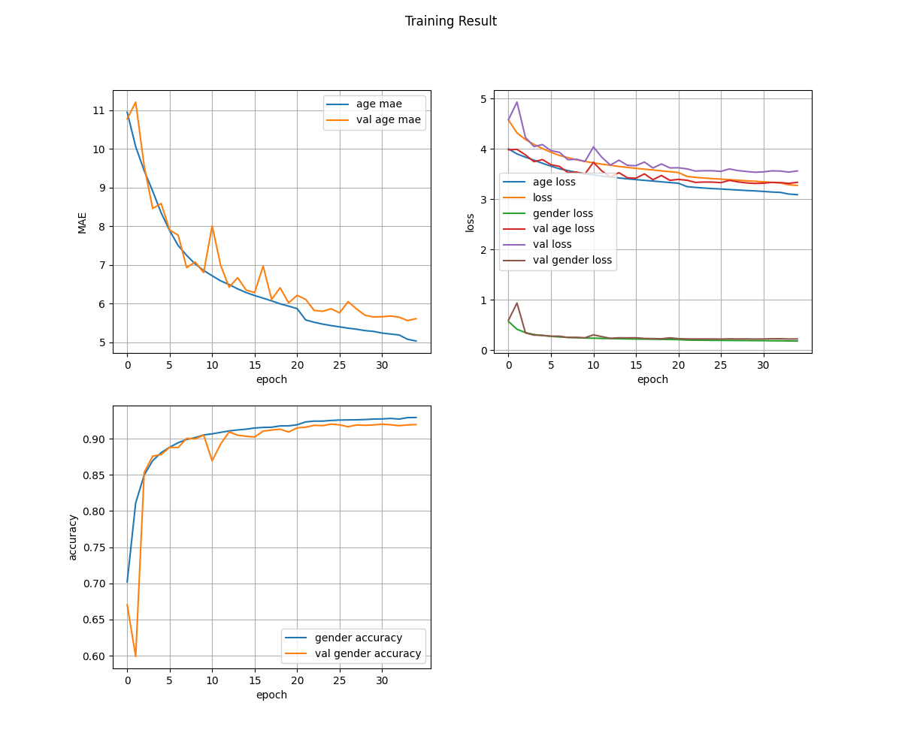

# Age and Gender estimation
Age and gender estimation using CNN. The model was trained on [the IMDB and Wiki dataset](https://data.vision.ee.ethz.ch/cvl/rrothe/imdb-wiki/). The APPA-real-realease dataset was used for test phase. 

# Requirements
- `Tensorflow >= 2.0.1
- `mtcnn`
- `opencv`

See `requirements.txt` for full requirements. All packages can be installed by `pip` easily.

# Train the model
At first, download face-only datasets from the dataset home page, extract and put them anywhere you'd like. The project structure should be as follows:
```
-- age-gender-estimation
 |
 |-- data
 |    |
 |    |-- imdb_crop
 |    |-- wiki_crop
 |    |-- appa-real-release
 |
 |-- train.py
 |-- README.md
 ...
```
Train the model with the following command.
```
python train.py --batch_size 128 --epochs 100 --lr 1e-3 --data_dir data --save_dir saved_models
```
When the training process finished, a file named `history.npy` should be saved to folder `saved_models` as default. Run `python plot_curve.py --input_path saved_models/history.npy` for visualization.


# Test the model
We also provided a [pretrained model](https://drive.google.com/open?id=1q0MNA2TzB8b4CgcqR2UoaeG2nKOXivB0) to help you instantly test it. If you'd like to test on a single image, run `python test_on_image.py --model_path MODEL_PATH --image_path IMAGE_PATH`. Otherwise, in case you'd like to test on realtime camera, run `python test_on_camera.py --model_path MODEL_PATH --image_path IMAGE_PATH`.

# Contact
Any question could be left as issues. Contact me via email tamvannguyen200795@gmail.com. You're all welcome.
